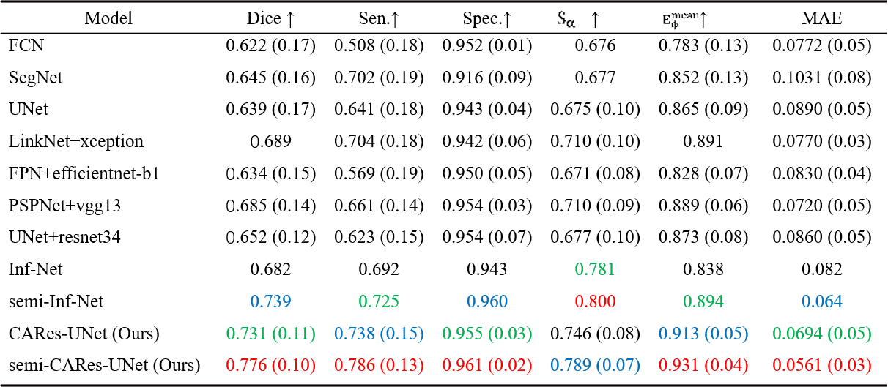
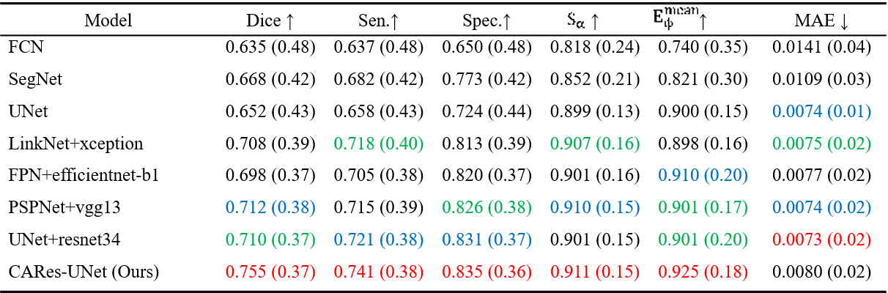

# CARes-UNet: Content-Aware Residual UNet for Lesion Segmentation of COVID-19 from Chest CT Images

This repository contains the source code for the paper [CARes-UNet: Content-aware residual UNet for lesion segmentation of COVID-19 from chest CT images](https://doi.org/10.1002/mp.15231) published in *Medical Physics*.

## 0. Table of Contents
* [1. Authors & Maintainers](#1-authors---maintainers)
* [2. Change Log](#2-change-log)
* [3. Abstract](#3-abstract)
* [4. Overview of Our Approach](#4-overview-of-our-approach)
  + [4.1 Network Architecture](#41-network-architecture)
  + [4.2 Semi-supervised Framework](#42-semi-supervised-framework)
  + [4.3 Experiment Results](#43-experiment-results)
* [5. Usage](#5-usage)
  + [5.1 Prerequisites](#51-prerequisites)
  + [5.2 Data Preparation](#52-data-preparation)
  + [5.3 Training](#53-training)
  + [5.4 Testing](#54-testing)
* [6. License](#6-license)
* [7. Citation](#7-citation)
* [8. To-Do List](#8-to-do-list)

## 1. Authors & Maintainers

- [Xinhua Xu|@sysu19351158](https://github.com/sysu19351158)
- [Yuhang Wen|@Necolizer](https://github.com/Necolizer)
- [Yi Zhang|@zylye123](https://github.com/zylye123)
- [Youjun Zhao|@zhaoyjoy](https://github.com/zhaoyjoy)
- [Zixuan Tang|@sysu19351118](https://github.com/sysu19351118)

## 2. Change Log

- [2021/10/13] Our paper has been published online.
- [2021/06/26] Improve Readme reading experience and provide more details.
- [2021/03/27] Modify Readme file.
- [2021/03/26] Create repository and release source code. 

## 3. Abstract

- **Purpose**: *Coronavirus disease 2019* has caused a serious global
  health crisis. It has been proven that the deep learning method has great potential
  to assist doctors in diagnosing COVID-19 by automatically segmenting the
  lesions in *computed tomography* slices. However, there are still several
  challenges restricting the application of these methods, including high variation
  in lesion characteristics and low contrast between lesion areas and healthy tissues.
  Moreover, the lack of high-quality labeled samples and large number of
  patients lead to the urgency to develop a high accuracy model, which performs
  well not only under supervision but also with semi-supervised methods.
- **Methods**: We propose a content-aware lung infection segmentation deep residual
  network (content-aware residual UNet (**CARes-UNet**)) to segment the lesion
  areas of COVID-19 from the chest CT slices. In our CARes-UNet, the residual
  connection was used in the convolutional block, which alleviated the degradation
  problem during the training. Then, the content-aware upsampling modules were
  introduced to improve the performance of the model while reducing the computation
  cost. Moreover, to achieve faster convergence, an advanced optimizer
  named Ranger was utilized to update the model’s parameters during training.
  Finally, we employed a semi-supervised segmentation framework to deal with
  the problem of lacking pixel-level labeled data.
- **Results**: We evaluated our approach using **three public datasets with multiple**
  **metrics** and compared its performance to several models. Our method outperforms
  other models in multiple indicators. More ablation studies were done and
  validated the effectiveness of each key component of our proposed model.

## 4. Overview of Our Approach

### 4.1 Network Architecture


**Figure 1** Network architecture of CARes-UNet

### 4.2 Semi-supervised Framework


**Figure 2** Overview of our semi-supervised framework

### 4.3 Experiment Results


**Figure 3** Qualitative analysis of different models.





## 5. Usage

### 5.1 Prerequisites

The code is built at least with the following libraries: [Python](https://www.python.org/) ; [PyTorch](https://pytorch.org/) ; Python Imaging Library ; Matplotlib ; Numpy.

### 5.2 Data Preparation

1. Download [COVID-SemiSeg Dataset](https://github.com/DengPingFan/Inf-Net), [COVID-19 Lung CT Lesion Segmentation Challenge – 2020 dataset](https://covid-segmentation.grand-challenge.org/) or [UESTC-COVID-19 Dataset](https://faculty.uestc.edu.cn/HiLab/en/article/379152/content/3319.htm)
2. Preprocess
3. Divide all the labeled CT slices into training set and testing set
4. Put labeled ones and unlabeled ones into the following repository (which should be created firstly):
   - `.\Train-Image`: origin CT slices of labeled training set
   - `.\Train-Mask` : ground truth of labeled training set
   - `.\Test-Image` : origin CT slices of labeled testing set
   - `.\Test-Mask` : ground truth of labeled testing set
   - `.\Unlabeled` : unlabeled  CT slices

### 5.3 Training

- For **supervised** training, run

```bash
python supervised_train.py
```

- For **semi-supervised** training, run

```bash
python supervised_train.py
python fake_labels_generator.py --model_path path\to\model --Image_dir .\Unlabeled --Mask-dir .\Pos-Mask
python semi-supervised_train.py --semi_img_path .\Unlabeled
```

`path\to\model ` refers to the path of checkpoint saved in supervised training.

### 5.4 Testing

For testing, run

```bash
python test.py --pretrained_model path\to\model
```

`path\to\model ` refers to the path of checkpoint saved in supervised or semi-supervised training.

Lesion Segmentation results will be stored in `.\CARes_Unet`.

## 6. License

[MIT](https://github.com/zylye123/CARes-UNet/blob/master/LICENSE)

## 7. Citation

If you find this work or code helpful in your research, please consider citing:

```
@article{https://doi.org/10.1002/mp.15231,
author = {Xu, Xinhua and Wen, Yuhang and Zhao, Lu and Zhang, Yi and Zhao, Youjun and Tang, Zixuan and Yang, Ziduo and Chen, Calvin Yu-Chian},
title = {CARes-UNet: Content-aware residual UNet for lesion segmentation of COVID-19 from chest CT images},
journal = {Medical Physics},
volume = {48},
number = {11},
pages = {7127-7140},
keywords = {computed tomography (CT) image, content-aware residual UNet, coronavirus disease 2019 (COVID-19), deep learning, segmentation},
doi = {https://doi.org/10.1002/mp.15231},
url = {https://aapm.onlinelibrary.wiley.com/doi/abs/10.1002/mp.15231},
eprint = {https://aapm.onlinelibrary.wiley.com/doi/pdf/10.1002/mp.15231},
abstract = {Abstract Purpose Coronavirus disease 2019 (COVID-19) has caused a serious global health crisis. It has been proven that the deep learning method has great potential to assist doctors in diagnosing COVID-19 by automatically segmenting the lesions in computed tomography (CT) slices. However, there are still several challenges restricting the application of these methods, including high variation in lesion characteristics and low contrast between lesion areas and healthy tissues. Moreover, the lack of high-quality labeled samples and large number of patients lead to the urgency to develop a high accuracy model, which performs well not only under supervision but also with semi-supervised methods. Methods We propose a content-aware lung infection segmentation deep residual network (content-aware residual UNet (CARes-UNet)) to segment the lesion areas of COVID-19 from the chest CT slices. In our CARes-UNet, the residual connection was used in the convolutional block, which alleviated the degradation problem during the training. Then, the content-aware upsampling modules were introduced to improve the performance of the model while reducing the computation cost. Moreover, to achieve faster convergence, an advanced optimizer named Ranger was utilized to update the model's parameters during training. Finally, we employed a semi-supervised segmentation framework to deal with the problem of lacking pixel-level labeled data. Results We evaluated our approach using three public datasets with multiple metrics and compared its performance to several models. Our method outperforms other models in multiple indicators, for instance in terms of Dice coefficient on COVID-SemiSeg Dataset, CARes-UNet got the score 0.731, and semi-CARes-UNet further boosted it to 0.776. More ablation studies were done and validated the effectiveness of each key component of our proposed model. Conclusions Compared with the existing neural network methods applied to the COVID-19 lesion segmentation tasks, our CARes-UNet can gain more accurate segmentation results, and semi-CARes-UNet can further improve it using semi-supervised learning methods while presenting a possible way to solve the problem of lack of high-quality annotated samples. Our CARes-UNet and semi-CARes-UNet can be used in artificial intelligence-empowered computer-aided diagnosis system to improve diagnostic accuracy in this ongoing COVID-19 pandemic.},
year = {2021}
}
```

## 8. To-Do List

- [x] Paper Published
- [x] Create GUI for presentation
- [x] Test on larger datasets
- [ ] Improve semi-supervised learning methods
